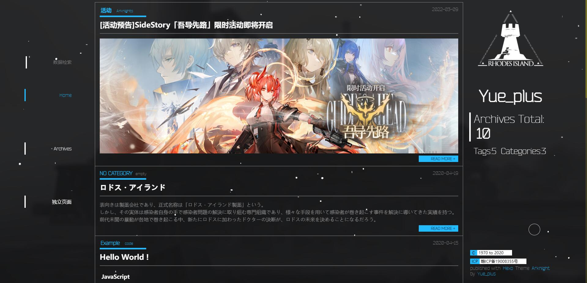

| [简体中文](README.md)
| [English](README.en.md)
| [日本語](README.ja.md)
|

# hexo-theme-arknights

## 预览

- ### **Dr.Yue_plus: <http://arknights.theme.hexo.yue.zone/>**
- ### **Dr.ToUNVRSe <https://tounvrse.github.io/>**
- **Dr.Ye: <https://laurenfrost.github.io/>**
- **Dr.LingYun: <https://dr-lingyun.gitee.io/>**
- **Dr.XIMU：<http://b.ligzs.cn/>**
- **Dr.tyqtyq <https://tyq0712.github.io/>**
- **Dr.TTsdzb <https://ark.ttsdzb.monster/>**
- **Dr.Angine <https://angine.tech/>**
- **Dr.sjfhsjfh <https://sjfh.top/>**
- **Dr.Voilone <https://note.voiblog.top/>**
- **Zhongye1 <https://zhongye1.github.io/>**
- **Dr.yuanli-LFSW<https://blog.yuanli-lfsw.com/>**
- **Dr.Rimrose: <https://blog.rimrose.site>**
- **Dr.Laplacian: <https://rhinelab.kr>**
- **Dr.Chen: <https://light-of-hers.github.io>**
- **Dr.Linyee <https://linyee.world/>**

如果使用了这个主题，欢迎在这儿贴预览链接~



## 安装

### 环境

- [Node.js `16.13.x` 以上](https://nodejs.org/zh-cn/)
- [最新版 Hexo](https://hexo.io/zh-cn/)
  > Hexo `6.0.0` 以上；
  > hexo-cli `4.3.0` 以上；
- 中国大陆用户推荐使用 `cnpm` 安装依赖包，参考 [中国 NPM 镜像](https://npmmirror.com/)

### 使用 `hexo-cli` 新建博客项目：

```shell
hexo init Hexo
cd Hexo
cnpm install
git clone https://github.com/Yue-plus/hexo-theme-arknights.git themes/arknights
```

### 安装依赖

npm 用户：

```shell 
cnpm install hexo-server hexo-browsersync hexo-renderer-pug --save
```

yarn 用户：

```shell
yarn add hexo-server hexo-browsersync hexo-renderer-pug
```

## 修改配置文件

- 参照 [Hexo 官网](https://hexo.io/zh-cn/docs/configuration) 修改 `Hexo/` 目录下的 `_config.yml`。
  - 将 `theme:` 的默认值 `landscape` 改为 `arknights`
  - 开启代码高亮：

    ```yml
    highlight:
      hljs: true
    ```

- **剪切** [`Hexo/themes/arknights/_config.yml`](https://github.com/Yue-plus/hexo-theme-arknights/blob/main/_config.yml) 到 `Hexo` 目录下，并重命名为 `_config.arknights.yml`。
  > 建议参考：
  > - [使用代替主题配置文件](https://hexo.io/zh-cn/docs/configuration#%E4%BD%BF%E7%94%A8%E4%BB%A3%E6%9B%BF%E4%B8%BB%E9%A2%98%E9%85%8D%E7%BD%AE%E6%96%87%E4%BB%B6)

  主题的配置文件可参照中文注释修改。

## 修改资源文件

可按需在 `Hexo/source/` 目录添加以下文件：

- `CNAME`: GitHub Pages 部署时的自定义域名
- `img/` 目录下的 `Alipay.png` 与 `WeChat.png` 为自己的收款二维码（1:1 比例的 `png` 图片）；

可按需修改 `Hexo/themes/arknights/source/` 目录下的：

- `favicon.ico`：浏览器标签页上的图标（64*64，分辨率高了显示不出）
- `README.md`: 部署仓库的 README

## 写作

- 参考 [写作 | Hexo](https://hexo.io/zh-cn/docs/writing)。
- 在主题仓库的 Hexo 分支有一些 [示例文本](https://github.com/Yue-plus/hexo-theme-arknights/tree/hexo/source/_posts) 可以取用
- 添加文章标签与分类，更多特性可参考 [Hexo | Front-matter](https://hexo.io/zh-cn/docs/front-matter) ，示例：
  
  ```markdown
  ---
  title: 'Hello World !'
  date: 2020-04-15 21:54:02
  tags: code
  category: Example
  ---
  ```

- 在 `<!-- more -->` 之前的内容称之为摘要，会显示在首页上，并且可以设置是否也在正文显示。

## 在导航栏中添加页面

- 例如：新建一个 `about` 页面
  + 在 `Hexo` 目录下执行 `hexo new page 'about'` 
  + 然后 `Hexo/source/` 目录下会多一个 `about` 文件夹
- 编辑 `Hexo/source/about/index.md` 文件
- 编辑 `_config.arknights.yml`，添加一个链接：

  ```yml
  menu:
    About: /about
  ```

## 禁止归档页翻页

该设置位于 Hexo 配置文件 `_config.yml` 约第 88 行。

```yaml
# Pagination
## Set per_page to 0 to disable pagination
per_page: 10
pagination_dir: page
```

将 `per_page:` 改为 0 即可。

## 评论系统

### Valine

本主题支持[Valine](https://valine.js.org/) 。
请参考 [Valine 快速开始](https://valine.js.org/quickstart.html) 修改 Hexo 目录下的 `_config.arknights.yml` 文件：

```yaml
valine:
  enable: false
  app_id: # APP ID
  app_key: # APP KEY
  server_url: # APP DOMAIN（LeanCloud 国际版）
  avatar: 'retro' # (''/mp/identicon/monsterid/wavatar/robohash/retro/hide)
  avatar_cdn: 'https://dn-qiniu-avatar.qbox.me/avatar/' # 自定义 avatar cdn
```

开启邮件提醒：[zhaojun1998 / Valine-Admin](https://github.com/zhaojun1998/Valine-Admin)

> **注意！** 当 Valine 使用 *LeanCloud 国际版* 时，才需要配置 `server_url:`。  
> 该设置可在 LeanCloud 应用中的 `设置 -> 应用凭证 -> 域名白名单 -> Request 域名` 中找到以 `.api.lncldglobal.com` 结尾的域名，加上 `https://` 前缀即可。

### Gitalk

本主题支持 [Gitalk](https://gitalk.github.io/) 。
请参考 [gitalk/readme-cn.md](https://github.com/gitalk/gitalk/blob/master/readme-cn.md) 修改 Hexo 目录下的 `_config.arknights.yml` 文件：

```yaml
gitalk:
  enable: false
  client_id: # GitHub 应用 Client ID
  client_secret: # GitHub 应用 Client Secret
  repo: # 用于存放评论数据的 GitHub 仓库
  owner: # 该 GitHub 仓库所有者
  admin: [] # 具有写该 GitHub 仓库权限的用户
            # 例如: [adminA,adminB]
  id: # (可选) 页面的唯一标识
      # 例如: location.pathname
```

### Waline

本主题支持 [Waline](https://waline.js.org/) 。  
请参考 Waline 官方文档 修改 Hexo 目录下的 `_config.arknights.yml` 文件:  

```yaml
waline:
  enable: false 
  server_url: # Server_Url
```

### Artalk

本主题支持 [Artalk](https://artalk.js.org/) 。  
请参考 Artalk 官方文档修改 Hexo 目录下的 `_config.arknights.yml` 文件: 

```yaml
artalk:
  enable: false
  server: https://artalk.server.instance/ # 你的 Artalk 服务地址
  site_name: My Blog # 站点名称，用于区分多个站点（可选）
```

## 数学公式

本主题支持两种方案显示数学公式：

### 方案一：静态渲染

可以使用 [hexo-filter-mathjax](https://github.com/next-theme/hexo-filter-mathjax) Hexo 过滤器静态渲染，来显示数学公式。

建议先更换能更好处理数学公式的 markdown 渲染器 [hexo-renderer-pandoc](https://github.com/wzpan/hexo-renderer-pandoc)。

1. 在 Hexo 目录下执行以下指令：

   ```shell script
   # 安装 hexo-filter-mathjax 插件
   cnpm install hexo-filter-mathjax --save
   # 清除缓存
   hexo clean
   ```

2. 把以下内容添加到 `Hexo/_config.yml` 文件：

   ```yaml
   mathjax:
     tags: none # 或 'ams' 或 'all'
     single_dollars: true # 启用单个美元符号作为内联（行内）数学公式定界符
     cjk_width: 0.9 # 相对 CJK 字符宽度
     normal_width: 0.6 # 相对正常（等宽）宽度
     append_css: true # 将 CSS 添加到每个页面
     every_page: false # 如果为 true，那么无论每篇文章的前题中的 `mathjax` 设置如何，每页都将由 mathjax 呈现
   ```

3. 在需要启用 mathjax 的文章的 [Front-matter](https://hexo.io/zh-cn/docs/front-matter) 区内添加 `mathjax: true`：

   ```markdown
   ---
   title: On the Electrodynamics of Moving Bodies
   categories: Physics
   date: 1905-06-30 12:00:00
   mathjax: true
   ---
   ```

   然后，就可以在文章中使用 LaTeX 语法。

4. 需要注意，内联数学公式（…… `$<数学公式>$` ……）在开头 `$` 之后和结尾 `$` 之前不能有空格！例如：

   ```diff
   - $ \epsilon_0 $
   + $\epsilon_0$
   - $ \frac{\partial}{\partial t} $
   + $\frac{\partial}{\partial t}$
   ```

5. 需要注意 LaTeX 与 Markdown 语法之间的冲突。如有必要，请使用 `\` 进行转义：

   ```diff
   - $\epsilon_0$
   + $\epsilon\_0$
   - \begin{eqnarray*}
   + \begin{eqnarray\*}
   ```

### 方案二：动态渲染

本主题也支持 [MathJax](https://www.mathjax.org/) ，在用户浏览时动态渲染公式：

1. 首先要卸载 Hexo 默认自带的 hexo-renderer-marked 渲染器，更换成对 MathJax 支持更好的 [hexo-renderer-kramed](https://github.com/sun11/hexo-renderer-kramed) 渲染器：

   ```shell
   npm uninstall hexo-renderer-marked --save
   npm install hexo-renderer-kramed --save
   ```

2. 修改 **Hexo 目录** 下的 `_config.arknights.yml` 文件：

   ```diff
     # 公式支持
     mathjax:
   -   enable: false
   +   enable: true
     version: '2.6.1'  # 重要
   ```

3. 然后，就可以在文章中使用 LaTeX 语法：

   ```latex
   % 单行内联公式
   % 注意需要两边带上 "`" ，且 "`" 与 "$" 之间不能有空格
   `$\sigma$`
   
   % 多行公式
   $$
   \begin{aligned}f(x) &= \sum_{i=1}^{\infty}{\frac{x}{2^i}} \\
   &= x\end{aligned}
   $$
   ```

4. 用这种方案，不会造成 LaTeX 与 Markdown 语法之间的冲突。在文中使用 LaTeX 语法不需要转义。
   以下公式可以直接使用，不会造成任何问题：

   ```latex
   \epsilon_0
   \begin{eqnarray*}
   ```

hexo-renderer-kramed 插件还有其他可配置项，请参考插件文档： https://github.com/sun11/hexo-renderer-kramed

几种公式显示方案各有优缺点：

1. 动态渲染方案 LaTeX 语法不需要转义，能更好的支持从其他地方导出的 Markdown 文件。但因为需要在浏览器渲染，页面显示会略有延迟。
2. 静态渲染方案将公式直接编译在静态文件里，显示性能更优，但语法需要转义。
3. [hexo-renderer-pandoc](https://github.com/wzpan/hexo-renderer-pandoc) 快速显示公式而不必经历转义语法的麻烦，但需要安装 Pandoc。

## 图表支持

修改 **Hexo 目录** 下的 `_config.arknights.yml` 文件：

```diff
  # 图表支持
  mermaid:
-   enable: false
+   enable: true
    version: '8.13.5'
```

主题通过 mermaid-js 绘制各种图表。**[查看示例](https://arknights.theme.hexo.yue.zone/mermaid/)**

支持：
[流程图](https://arknights.theme.hexo.yue.zone/mermaid/#%E6%B5%81%E7%A8%8B%E5%9B%BE)
| [序列图](https://arknights.theme.hexo.yue.zone/mermaid/#%E5%BA%8F%E5%88%97%E5%9B%BE)
| [类图](https://arknights.theme.hexo.yue.zone/mermaid/#%E7%B1%BB%E5%9B%BE)
| [状态图](https://arknights.theme.hexo.yue.zone/mermaid/#%E7%8A%B6%E6%80%81%E5%9B%BE)
| [实体关系图](https://arknights.theme.hexo.yue.zone/mermaid/#%E5%AE%9E%E4%BD%93%E5%85%B3%E7%B3%BB%E5%9B%BE)
| [用户旅程图](https://arknights.theme.hexo.yue.zone/mermaid/#%E7%94%A8%E6%88%B7%E6%97%85%E7%A8%8B%E5%9B%BE)
| [甘特图](https://arknights.theme.hexo.yue.zone/mermaid/#%E7%94%98%E7%89%B9%E5%9B%BE)
| [指令图](https://arknights.theme.hexo.yue.zone/mermaid/#%E6%8C%87%E4%BB%A4%E5%9B%BE)
| [饼图](https://arknights.theme.hexo.yue.zone/mermaid/#%E9%A5%BC%E5%9B%BE)

语法：

```html
<div class="mermaid">
  graph LR
  A[Hard edge] -->|Link text| B(Round edge)
  B --> C{Decision}
  C -->|One| D[Result one]
  C -->|Two| E[Result two]
</div>
```

> 如果习惯使用 `代码块` 也完全支持。

## 字数/阅读时长统计

依赖 [`hexo-wordcount`](https://github.com/willin/hexo-wordcount)：

npm 用户：

```shell
cnpm install hexo-wordcount --save
```

yarn 用户：

```shell
yarn add hexo-wordcount
```

之后修改 **Hexo 目录** 下的 `_config.arknights.yml` 文件：

```yaml
post:
  count: true # 是否显示字数统计
  time: true # 是否显示阅读时长统计
```

## 浏览量统计

使用 [不蒜子](http://busuanzi.ibruce.info/) 进行浏览量统计。
修改 **Hexo 目录** 下的 `_config.arknights.yml` 文件启用该功能：

```yaml
busuanzi:
  enable: false
  sitePV: true # 站点总访问量
  siteUV: true # 站点访客数
  pagePV: true # 页面访问量
```

## 文档加密

经过修改的 [hexo-blog-encrypt](https://github.com/D0n9X1n/hexo-blog-encrypt) 插件已适配并集成在本主题中（目前仅支持 default 与 up 主题）。

> 详细配置参考 [hexo-blog-encrypt/ReadMe.zh.md](https://github.com/D0n9X1n/hexo-blog-encrypt/blob/master/ReadMe.zh.md)

在 `Hexo/_config.yml` 文件中添加以下内容：

```yml
# Security
encrypt: # hexo-blog-encrypt
  abstract: 与 Rhodes Island™ 取得弱神经连接时需要口令
  message: 请输入与 Rhodes Island™ 取得弱神经连接时的口令：
  tags:
  - {name: tagName, password: 密码A}
  - {name: tagName, password: 密码B}
  wrong_pass_message: 与 Rhodes Island™ 效验口令失败，请重试。
  wrong_hash_message: 与 Rhodes Island™ 效验口令失败，当前使用临时权限查看。
```

**或** 在文章的 [Front-matter](https://hexo.io/zh-cn/docs/front-matter) 区内设置：

```markdown
---
title: Hello World
tags:
- 作为日记加密
date: 2016-03-30 21:12:21
password: mikemessi
abstract: 与 Rhodes Island™ 取得弱神经连接时需要口令
message: 请输入与 Rhodes Island™ 取得弱神经连接时的口令：
wrong_pass_message: 与 Rhodes Island™ 效验口令失败，请重试。
wrong_hash_message: 与 Rhodes Island™ 效验口令失败，当前使用临时权限查看。
---
```

## 搜索

默认开启，若要关闭，在 `Hexo/_config.arknights.yml` 文件中：

```yaml
search:
  enable: false
```

## Front-matter

除了 [Hexo 支持的 Front-matter](https://hexo.io/zh-cn/docs/front-matter) 还支持：

```yaml
# 文章发布/更新日期
post-time: true/false

# 文章阅读时间/词数统计
post-count: true/false

# 文章不蒜子统计
busuanzi: true/false

# 开启/关闭以上全部
post-info: true/false

# 侧边栏的目录
post-index: true/false

# 打赏框
reward: true/false
```

## 额外标签

### admonition

```text

content

```

添加提示、警告、错误等块式内容，其中 `note/warning/success/failure` 有图标，`detail` 无图标。

### hide

```

```

隐藏内容，content 支持 markdown 渲染、可以有空格，无须使用引号。

### link card/linkc

```

Title1:
    avatar: https://someLink/someAvatar.png
    src: https://someLink/
    img: https://somelink/somePicture.png
    descr: someDescr
    style:
    	color: someColor
Title2:
    avatar: https://someLink/someName.png
    src: https://someLink/

```

可生成一组友链，标题（title）、与链接（src）为必选项。样式（style）遵循 CSS 格式。

## 引入自定义 CSS/JS 文件

可以在 `Hexo/source/css/` 目录下放入自己的 CSS 文件；
在 `Hexo/source/js/` 目录下放入自己的 JavaScript 脚本文件；

然后修改 `Hexo/_config.arknights.yml` 文件：

```diff
  # 在 `<head>` 标签内引入 CSS 样式表
  stylesheets:
+ - /css/custom.css
  
  # 在 `<body>` 尾部引入 JavaScript 脚本
  scripts:
+ - /js/custom.js
```

> 资源文件夹是存放用户资源的地方。
> 除 `_posts` 文件夹之外，开头命名为 `_` (下划线)的文件/文件夹和隐藏的文件将会被忽略。
> Markdown 和 HTML 文件会被解析并放到 `public` 文件夹，而其他文件会被拷贝过去。
>
> ——来自 [Hexo 官方文档](https://hexo.io/zh-cn/docs/setup#source)

## 参与开发

欢迎提交 [Issues](https://github.com/Yue-plus/hexo-theme-arknights/issues/new) 与 [PR](https://github.com/Yue-plus/hexo-theme-arknights/pulls)。

### 分支说明

| 分支       | 说明                            |
|----------|-------------------------------|
| main     | 相对稳定的版本                       |
| gh-pages | gh-page 托管                    |
| hexo     | Hexo 目录，这里有可以用于测试主题的 `.md` 文件 |

### 开发中可能遇见的问题及解决方法

#### 修改 TS 文件不生效

TypeScript 需要手动编译，请全局安装 `typescript` 后在 `arknights\source\js\_src` 目录下执行 `tsc` 以编译。

#### 运行 `hexo serve --debug` 时，长文章渲染不全

这是由热重载插件 `hexo-browsersync` 导致的，不会影响发布。

解决方法：禁用该插件。（反正不影响发布，不管也行）

### 参与开发可能需要的文档

- [Hexo 官方文档](https://hexo.io/zh-cn/docs/templates)
- [Stylus 中文网](http://stylus.bootcss.com/)
- [Pug 模板引擎中文文档](https://www.pugjs.cn/api/getting-started.html)

- 另外引用几个大佬的 Blog
  > - [Easy Hexo](https://easyhexo.com/)
  > - [让 Hexo 搭建的博客支持 LaTeX](http://cps.ninja/2019/03/16/hexo-with-latex/)
  > - [Hexo主题开发 - ﹏猴子请来的救兵 - 博客园](https://www.cnblogs.com/yyhh/p/11058985.html)
  > - [Hexo主题开发经验杂谈 | MARKSZのBlog](https://molunerfinn.com/make-a-hexo-theme/)
  > - [Hexo 主题开发指南 | Peak Xin's Blog](https://xinyufeng.net/2019/04/15/hexo-theme-guide/)

### 贡献者

- [ToUNVRSe](https://github.com/ToUNVRSe)
- [Yue_plus](https://github.com/Yue-plus)
- [TTsdzb](https://github.com/TTsdzb)
- [arkerny](https://github.com/arkerny)
- [DarkLingYun](https://github.com/DarkLingYun)
- [Laurenfrost](https://github.com/Laurenfrost)
- [安擎Angine](https://github.com/angine04)
- [飞龙project](https://github.com/feilongproject)
- [sjfhsjfh](https://github.com/sjfhsjfh)
- [Thexvoilone](https://github.com/Thexvoilone)
- [RyoJerryYu](https://github.com/RyoJerryYu)
- [wmz1024](https://github.com/wmz1024)
- [madisontanle](https://github.com/madisontanle)
- [SherkeyXD](https://github.com/SherkeyXD)
- [soundofautumn](https://github.com/soundofautumn)
- [LongFengShuanWu](https://github.com/LongFengShuanWu)
- [Zhongye1](https://github.com/Zhongye1)
- [ChisatoNishikigi73](https://github.com/ChisatoNishikigi73)

## 支援主题开发

喜欢这个主题的话可以：

- 给颗小星星吧 `(/▽＼)`
  > - √ `ヾ(✿ﾟ▽ﾟ)ノ` 100star 做个新主题哦~
  > - 新主题开发中：
  >   + [Yue-plus/astro-arknights](https://github.com/Yue-plus/astro-arknights)
  >   + [Yue-plus/vuepress-theme-rhinelab](https://github.com/Yue-plus/vuepress-theme-rhinelab)
- 开发者的B服ID：`24444750`
- 加入 QQ 群：[618221514](https://qm.qq.com/q/QJ7NPWiWyK)
  > 群内开发为主，吹水晒卡，分享线索7也都欢迎哦~ `d=====(￣▽￣*)b`
- 打赏、赞助:
  
