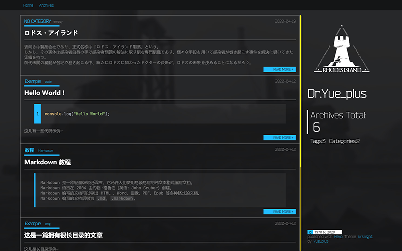

# hexo-theme-arknights

## 多国语言Readme  
[日本語バージョン](README-Ja.md)  

## 预览
- ### **Dr.Yue_plus: <http://ark.theme.yueplus.ink/>**
- **Dr.Ye: <https://laurenfrost.github.io/>**
- **Dr.LingYun: <https://dr-lingyun.gitee.io/>**
- **Dr.XIMU：<http://b.ligzs.cn/>**

如果使用了这个主题，欢迎在这儿贴预览链接~




## 安装
### [一键下载](https://github.com/Yue-plus/hexo-theme-arknights/releases)

## 手动安装
根据需要执行以下代码
```shell script
hexo init Hexo
cd Hexo
npm install -g cnpm --registry=https://registry.npm.taobao.org
cnpm install
git clone https://github.com/Yue-plus/hexo-theme-arknights.git themes/arknights
```

### 安装依赖
npm 用户：
```shell script 
cnpm install hexo-server hexo-browsersync hexo-renderer-pug hexo-renderer-sass hexo-renderer-ts --save
```
yarn 用户：
```shell script
yarn add hexo-server hexo-browsersync hexo-renderer-pug hexo-renderer-sass hexo-renderer-ts
```
> `hexo-renderer-sass` 很可能会安装失败，请多试几次。

### 修改配置文件
- 参照 [Hexo 官网](https://hexo.io/zh-cn/docs/configuration) 修改 `Hexo/` 目录下的 `_config.yml`。
    - 把 `theme:` 的值改为 `arknights`
    - 开启代码高亮：
      ```yml
      highlight:
        hljs: true
      ```
- 查看 `Hexo/themes/arknights/`目录下的 `_config.yml`。
  > 建议参考：[使用代替主题配置文件](https://hexo.io/zh-cn/docs/configuration#%E4%BD%BF%E7%94%A8%E4%BB%A3%E6%9B%BF%E4%B8%BB%E9%A2%98%E9%85%8D%E7%BD%AE%E6%96%87%E4%BB%B6)
  
  主题的配置文件可参照中文注释修改。

### 修改资源文件
可按需修改 `Hexo/themes/arknights/source/` 目录下的
- `favicon.ico`：浏览器标签页上的图标
- `CNAME`: GitHub Pages 部署时的自定义域名
- `README.md`: 部署仓库的 README
- `img/`目录下的 `Alipay.png` 与 `WeChat.png` 可替换为自己的二维码；
  1:1 比例的 `png` 图片；

## 写作
- 可参考 [Hexo | 写作](https://hexo.io/zh-cn/docs/writing)。
- 在主题仓库的 Hexo 分支有一些[示例文本](https://github.com/Yue-plus/hexo-theme-arknights/tree/hexo/source/_posts)可以取用
- 添加文章标签与分类，更多特性可参考 [Hexo | Front-matter](https://hexo.io/zh-cn/docs/front-matter) ，示例：
  ```markdown
  ---
  title: 'Hello World !'
  date: 2020-04-15 21:54:02
  tags: code
  category: Example
  ---
  ```
- 在 `<!-- more -->` 之前的内容称之为摘要，会显示在首页上，并且可以设置是否也在正文显示。

## 顶部导航栏新建自定义页面
- 例如：新建一个 `about` 页面
  在 `Hexo` 目录下执行
  ```shell script
  hexo new page 'about'
  ```
  然后 `Hexo/source/` 目录下会多一个 `about` 文件夹
- 编辑 `Hexo/source/about/index.md` 文件
- 编辑主题目录下的 `_config.yml`，添加一个链接：
  ```yml
  menu:
    About: /about
  ```

## 评论系统
本主题支持[Valine](https://valine.js.org/) 。
请修改主题目录下 `_config.yml` 文件中 `valine:` 的 `app_id:` 与 `app_key:` 。

参考 [Valine 快速开始](https://valine.js.org/quickstart.html)

开启邮件提醒：[zhaojun1998 / Valine-Admin](https://github.com/zhaojun1998/Valine-Admin)

## 数学公式
使用 [hexo-filter-mathjax](https://github.com/next-theme/hexo-filter-mathjax) Hexo 过滤器来显示数学公式：

1. 在 Hexo 目录下执行以下指令：

```shell script
# 安装 hexo-filter-mathjax 插件
cnpm install hexo-filter-mathjax --save
# 清除缓存
hexo clean
```

2. 把以下内容添加到 `<Hexo>/_config.yml` 文件：

```yml
mathjax:
  tags: none # 或 'ams' 或 'all'
  single_dollars: true # 启用单个美元符号作为内联（行内）数学公式定界符
  cjk_width: 0.9 # 相对 CJK 字符宽度
  normal_width: 0.6 # 相对正常（等宽）宽度
  append_css: true # 将 CSS 添加到每个页面
  every_page: false # 如果为 true，那么无论每篇文章的前题中的 `mathjax` 设置如何，每页都将由 mathjax 呈现
```

3. 在需要启用 mathjax 的文章的 [Front-matter](https://hexo.io/zh-cn/docs/front-matter) 区内添加 `mathjax: true`：
```markdown
---
title: On the Electrodynamics of Moving Bodies
categories: Physics
date: 1905-06-30 12:00:00
mathjax: true
---
```
然后，就可以在文章中使用 LaTeX 语法。

4. 需要注意，内联数学公式（…… `$<数学公式>$` ……）在开头 `$` 之后和结尾 `$` 之前不能有空格！例如：
```diff
-$ \epsilon_0 $
+$\epsilon_0$
-$ \frac{\partial}{\partial t} $
+$\frac{\partial}{\partial t}$
```

5. 需要注意 LaTeX 与 Markdown 语法之间的冲突。如有必要，请使用 `\` 进行转义：
```diff
-$\epsilon_0$
+$\epsilon\_0$
-\begin{eqnarray*}
+\begin{eqnarray\*}
```

> 也可以尝试更换能更好处理数学公式的渲染器 [hexo-renderer-pandoc](https://github.com/wzpan/hexo-renderer-pandoc)

## 图表支持

修改 **主题文件夹** 下的 `_config.yml` 文件，将 `mermaid:` 设为 `true`。

主题通过 mermaid-js 绘制各种图表。**[查看示例](https://ark.theme.yueplus.ink/mermaid/)**

支持：
- [流程图](https://ark.theme.yueplus.ink/mermaid/#%E6%B5%81%E7%A8%8B%E5%9B%BE)
- [序列图](https://ark.theme.yueplus.ink/mermaid/#%E5%BA%8F%E5%88%97%E5%9B%BE)
- [类图](https://ark.theme.yueplus.ink/mermaid/#%E7%B1%BB%E5%9B%BE)
- [状态图](https://ark.theme.yueplus.ink/mermaid/#%E7%8A%B6%E6%80%81%E5%9B%BE)
- [实体关系图](https://ark.theme.yueplus.ink/mermaid/#%E5%AE%9E%E4%BD%93%E5%85%B3%E7%B3%BB%E5%9B%BE)
- [用户旅程图](https://ark.theme.yueplus.ink/mermaid/#%E7%94%A8%E6%88%B7%E6%97%85%E7%A8%8B%E5%9B%BE)
- [甘特图](https://ark.theme.yueplus.ink/mermaid/#%E7%94%98%E7%89%B9%E5%9B%BE)
- [指令图](https://ark.theme.yueplus.ink/mermaid/#%E6%8C%87%E4%BB%A4%E5%9B%BE)
- [饼图](https://ark.theme.yueplus.ink/mermaid/#%E9%A5%BC%E5%9B%BE)

<!--## 文档加密

可以使用 [hexo-blog-encrypt](https://github.com/D0n9X1n/hexo-blog-encrypt) 插件进行文档加密。
**注意： 前端加密并不可靠！**

> 详细参考 [hexo-blog-encrypt/ReadMe.zh.md](https://github.com/D0n9X1n/hexo-blog-encrypt/blob/master/ReadMe.zh.md)

```sh
cnpm install hexo-blog-encrypt --save
```

在 `<Hexo>/_config.yml` 文件中添加以下内容：

```yml
# Security
encrypt: # hexo-blog-encrypt
  abstract: 与 Rhodes Island™ 取得弱神经连接时需要口令
  message: 请输入与 Rhodes Island™ 取得弱神经连接时的口令：
  tags:
  - {name: tagName, password: 密码A}
  - {name: tagName, password: 密码B}
  template: <div id="hexo-blog-encrypt" data-wpm="{{hbeWrongPassMessage}}" data-whm="{{hbeWrongHashMessage}}"><div class="hbe-input-container"><input type="password" id="hbePass" placeholder="{{hbeMessage}}" /><label>{{hbeMessage}}</label><div class="bottom-line"></div></div><script id="hbeData" type="hbeData" data-hmacdigest="{{hbeHmacDigest}}">{{hbeEncryptedData}}</script></div>
  wrong_pass_message: 与 Rhodes Island™ 效验口令失败，请重试。
  wrong_hash_message: 与 Rhodes Island™ 效验口令失败，当前使用临时权限查看。
```

**或** 在文章的 [Front-matter](https://hexo.io/zh-cn/docs/front-matter) 区内设置：

```markdown
---
title: Hello World
tags:
- 作为日记加密
date: 2016-03-30 21:12:21
password: mikemessi
abstract: 与 Rhodes Island™ 取得弱神经连接时需要口令
message: 请输入与 Rhodes Island™ 取得弱神经连接时的口令：
wrong_pass_message: 与 Rhodes Island™ 效验口令失败，请重试。
wrong_hash_message: 与 Rhodes Island™ 效验口令失败，当前使用临时权限查看。
---
```
-->

## Front-matter

除了 Hexo 支持的 [Front-matter](https://hexo.io/zh-cn/docs/front-matter)

还支持：

```yaml
# 文章页右上角发布/更新日期
post-info: true/false

# 侧边栏的目录
post-index: true/false

# 打赏框
reward: true/false
```

## 参与开发
### 开发人员
- [Yue_plus](https://github.com/Yue-plus)
- [Laurenfrost](https://github.com/Laurenfrost)

> 欢迎提交 [Issues](https://github.com/Yue-plus/hexo-theme-arknights/issues/new) 与 [PR](https://github.com/Yue-plus/hexo-theme-arknights/pulls)

### 分支说明
| 分支     | 说明                                           |
| -------- | ---------------------------------------------- |
| master   | 主题开发目录                                   |
| gh-pages | gh-page 托管                                   |
| hexo     | Hexo 目录，这里有可以用于测试主题的 `.md` 文件 |

### 搭建开发环境
先装好 [nodejs](https://nodejs.org/) 和 [yarn](https://classic.yarnpkg.com/zh-Hans/) ，然后执行以下命令：
```shell script
yarn global add hexo-cli yo generator-hexo-theme
git clone -b hexo https://github.com/Yue-plus/hexo-theme-arknights.git
cd hexo-theme-arknights
git clone https://github.com/Yue-plus/hexo-theme-arknights.git themes/arknights
yarn install
hexo serve --debug
```

### 开发中可能遇见的 BUG 及解决方法
#### 修改 `.pug` 模板文件无法自动刷新页面。
解决方法：将 Hexo 目录下的
`./node_modules/hexo-renderer-pug/lib/pug.js`
中的
`pugRenderer.compile = pugCompile;`
注释掉。

#### 运行 ‘hexo serve --debug’ 时，长文章渲染不全
这是由热重载插件 `hexo-browsersync` 导致的，不会影响发布
解决方法：禁用该插件。（反正不影响发布，不管也行）

#### 参与开发可能需要的文档
- [Hexo 官方文档](https://hexo.io/zh-cn/docs/templates)
- [SASS 中文网](https://www.sass.hk/guide/)
  > 注意，这个中文网标的是 SASS 但写的是 SCSS 的语法。
  > 其最大区别是 SASS 不要写分号和花括号、文件拓展名不同。
- [Pug 模板引擎中文文档](https://www.pugjs.cn/api/getting-started.html)

- 另外引用几个大佬的blog
  > - <https://easyhexo.com/>
  > - [让 Hexo 搭建的博客支持 LaTeX](http://cps.ninja/2019/03/16/hexo-with-latex/)
  > - [Hexo主题开发 - ﹏猴子请来的救兵 - 博客园](https://www.cnblogs.com/yyhh/p/11058985.html)
  > - 【墙】[Hexo主题开发经验杂谈 | MARKSZのBlog](https://molunerfinn.com/make-a-hexo-theme/)
  > - 【墙】[Hexo 主题开发指南 | Peak Xin's Blog](https://xinyufeng.net/2019/04/15/hexo-theme-guide/)

## 支援主题开发
喜欢这个主题的话可以：
- 给颗小星星吧 `(/▽＼)`
  > - √ `ヾ(✿ﾟ▽ﾟ)ノ` 100star 做个新主题哦~
  > - 新主题开发中 [Yue-plus/vuepress-theme-rhinelab](https://github.com/Yue-plus/vuepress-theme-rhinelab)
- 开发者的B服ID：`YuePlus#6221`
- 加入 QQ 群：618221514
    > 群内开发为主，吹水晒卡，分享线索7也都欢迎哦~ `d=====(￣▽￣*)b`
- 打赏、赞助:


    
